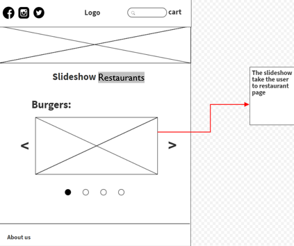
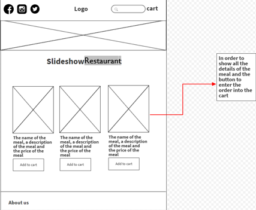
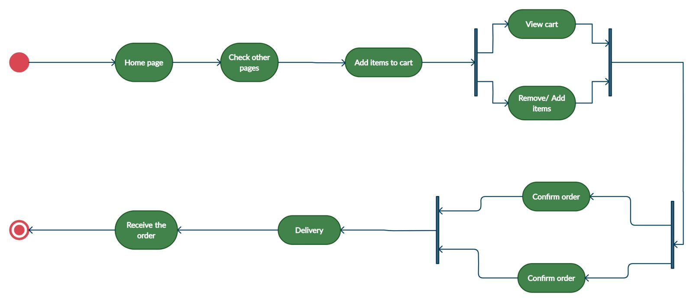

# Task 1 

## Task 1.1

The most business-related issue is that 
**in Jordan we don’t have different web pages for online nourishment requesting**.
 So, we have **made a web page that combines distinctive kind of eateries in one web page** so the online nourishment requesting handle is much less demanding for the user. 

 User and framework requirements:

 1- The domestic page contains a slideshow for the accessible eateries on the site, each nourishment category has its possess slideshow. 

 2- When the client clicks on the eatery that he/she needs the site will open the eateries page. 

 3- In each eatery page there’s a full menu.

 4- The client can check the shopping cart he/she filled and can remove/add to cart and can cancel arrange or put order.

 5- The client can see the charge subtle elements with each meal’s price.

 What I did is that I have created a website that includes all the user and framework reqirements to create an easier way for the online food processing 

## Task 2.1

**The risks we face in the process while creating the project:**

1-	Time management and task dividing: We had a vision for tomorrow but there was a lot of tasks we should do so we gave each one of us a task and by that we finished the project successfully.

2-	Bad team communication: Each one of us wanted to create something the opposite than the other and we had some struggles but at the end we chose the best solution and the solution that we all accepted. 

3-	Learn new things: Not all of us have the full knowledge to create an advanced web page so we helped each other and searched for ideas and answers on other sources like google. 

4-	Website is unstable: The website crashed many times while we were working on it but every time the website get crashed we figure it out and fix it. 

## Task 3.1

•	List of requirements:

1.	The system must have a home page that contains all restaurants in a slide show for each food category.

2.	The system must contain a href to go to the restaurants page to order.

3.	The system must contain a full menu in the restaurants page.

4.	The system must contain all the orders in the shopping cart and the user can cancel the order or place the order.

5.	The system must have a page to display the number of items the user has chosen.

6.	The system must have a page to display all invoice details.

•	Database design and the wireframe

**Database design:**

LocalStorage Function

We have a constructor that takes the name and the price of the meal after that it push it to an array after that it saves it to the LocalStorage and that’s how we save the data.

**Wireframe**

**Home page wireframe**

**Restaurants wireframe**

•	Activity Diagram

•	Coding and implementation technique

**Agile:** The Agile computer program improvement demonstrate was basically aiming for making a difference developers construct a extend which can adjust to transforming demands rapidly.

**Scrum** is the sort of Agile system. It could be a system inside which people can address complex adaptive issue whereas efficiency and inventiveness of delivering item is at most elevated conceivable values. Scrum employments Iterative process.

**Features of Scrum are:** 

 Scrum is light-weighted system.

 Scrum emphasizes self-organization.

 Scrum is straightforward to understand.

 Scrum system offer assistance the team to work together.

•	Testing technique

**Black box testing:** could be a sort of computer program testing in which the functionality of the program isn't known. The testing is done without the inner information of the items.

References:

[w3wschools](https://www.w3schools.com/)

[geeksforgeeks](https://www.geeksforgeeks.org/)